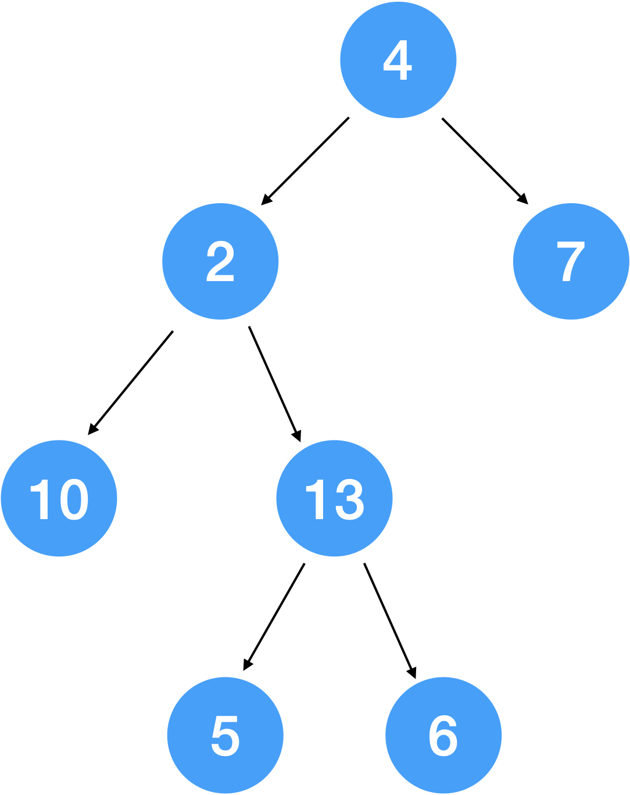
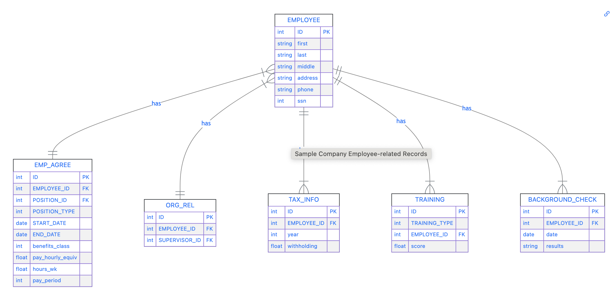

## Complex Data structures


:::: {.columns}

::: {.column width="30%"}

:::

::: {.column width="10%"}
<!-- empty column to create gap -->
:::

::: {.column width="60%"}

How would you encode this structure in python? how in R?

:::

::::


## Lists

Lists are a superset of all data structures

- allow multiple data formats
- allow items that are lists

Lists are python's basic data form: 

`[4, [2, [10, 13, [5, 6]], 7]]`

(needs convention of `[` starts children nodes and `]` finishes list of children)


In R there are list objects `list()`

## Tree in R

```{r echo=TRUE}
tree <- list(value = 4, children = 
               c(list(value = 2, children = 
                        c(list(value = 10, children = NULL), 
                          list(value = 13, children = 
                                 c(list(value = 5, children = NULL),
                                   list(value = 6, children = NULL))))), 
                 list(value = 7, children = NULL)))

str(tree)
```

## Trees

there are no native 'tree' objects in R or python (there are packages for sure), i.e. no standard implementation for trees

implementation as data frame:

```{r}
tree_df <- tibble::tibble(
  node_id = 1:7, 
  value = c(4, 2, 7, 10, 13, 5, 6), 
  children = c(I(list(c(2,3))), I(list(c(4,5))), I(list(c())), I(list(c())), I(list(c(6,7))), I(list(c())), I(list(c())))
)
tree_df
```

## Your Turn: Web Page Anatomy {.smaller .inverse}

Use the JSON specification at https://www.json.org/json-en.html to write out the tree


## XML can be expressed as list

Coerce list to xml: `as_xml_document`

xml to list: `xml2::as_list`

We need to be able to navigate along lists

## Working with lists

- `[` accesses sub lists

- `[[` accesses elements

- for well-structured lists more powerful tools: `map` (`purrr`)

Package `purrr`: https://purrr.tidyverse.org/reference/index.html

## Example: Employee Data 

Relational Overview





## Identify the Structures - follow the hierarchy

`xml_children` recovers the children of an XML node

```{r}
library(xml2)
xml_data <- read_xml("https://srvanderplas.github.io/stat-computing-r-python/data/sample_employee_data.xml")

xml_children(xml_data) # children's names look like the table names in the relational overview
```
## Employee Data

```{r}
library(tibble)
library(rlang)
employees <- xml_children(xml_data)[1] |> xml_children()
# list of employees

employees[[1]]
```

## Get all elements of one record

```{r}
make_row <- function(node) {
  if (xml_name(node) == "EMPLOYEE") {
    values <- xml_text(xml_children(node))
    names(values) <- xml_name(xml_children(node))
    
    as_tibble(t(values)) 
  }
}

employee_data <- employees |> purrr::map(.f = make_row) |> purrr::list_rbind()
```

## Your Turn

How do we need to modify the function `make_row` so that we can extract data for the background check?

Is your solution applicable to all the tables of the Employee database?

## Solution


```{r}
make_row <- function(node) {
  
  values <- xml_text(xml_children(node))
  names(values) <- xml_name(xml_children(node))
    
  as_tibble(t(values)) 
}
```

In practice we need to use some error handling
